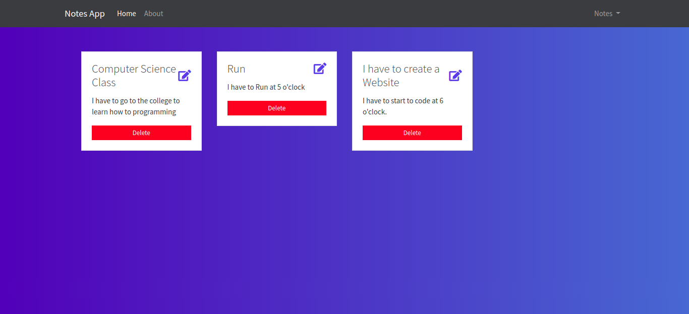

# Notes App with Node, Mongodb
This is a basic App to manage simple Notes on the web using Javascript Technologies like Nodejs, Mongodb, and so on.
This app can:
- create/read/update/delete Notes
- Allows a user to do log in and save his personal notes

# Screenshot

